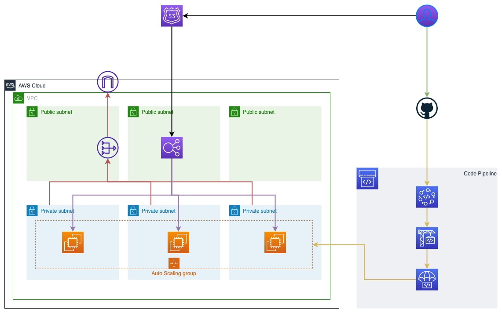

# TechOps CI/CD Demo Environment

## Introduction
One important aspect of DevOps is automating the deployment of infrastructure, applications and release of new features. And it'll be great if you can use Infrastructure-as-Code (IaC) together with cloud provider-native deployment tools to orchestrate and automate the deployment process. In this lab, I'll show you how can use Terraform to automate creation of AWS infrastructure, and work with AWS CodeDeploy to automate deployment of a sample application. Again, this is ALL-AWS Lab, which means, besides [Terraform](https://terraform.io) and [Github](https://github.com), I'll be using only AWS services in the lab.

### Topology


## Prerequisites
To complete this lab you will need the following requirements installed, configured or setup.
1. [Install Terraform](https://learn.hashicorp.com/tutorials/terraform/install-cli)
2. [Install AWS CLI](https://docs.aws.amazon.com/cli/latest/userguide/cli-chap-install.html)
3. [Signup a GitHub Account](https://docs.github.com/en/get-started/signing-up-for-github/signing-up-for-a-new-github-account)

## What exactly we will be doing in this lab?

In this lab, I will show you how you can automate and orchestrate creating your AWS infrastructure and pipline by using Terraform as IaC. This is a prerequisite to completing the TechOps CI/CD Challenge. 

1. Clone out this Git repo to your local machine.
2. Fork the ``` techops-ci-demo-application ``` repository to your GitHub Account
3. Update the ``` terraform.tf ``` file with your AWS Credentials or profile. 
4. Create your AWS environment with Terraform.
   1. ```terraform init``` to download all module dependencies and plugins
   2. ```terraform plan``` to confirm that credentials are working and what resources will be deployed
   3. ```terrafom apply``` to deploy the environment to your aws account
5. Authorise AWS CodeStar to access your GitHub Account
6. Deploy the application to the environment
7. Confirm that application is working as expected
8. Complete the Homework/Challenge Activity (optional and to be conducted in your own time)
9. Clean up

> Note: This lab focuses on automation capability of Terraform, ansible and CI/CD Pipelines, and is designed to give you basic to intermediate understanding on how these technologies work.

## Cost Estimate
This terraform stack utilises [infracost](https://www.infracost.io/) to estimate how much this environment would cost if you had it running 24/7 for a full month.
```md
Project: techops-ci-demo-infrastructure

 Name                                                                          Monthly Qty  Unit                    Monthly Cost

 module.ci-demo.aws_alb.ci_demo_alb
 ├─ Application load balancer                                                          730  hours                         $18.40
 └─ Load balancer capacity units                                         Monthly cost depends on usage: $5.84 per LCU

 module.ci-demo.aws_autoscaling_group.idea11_demo_asg_group
 └─ module.ci-demo.aws_launch_configuration.demo_launch_config
    ├─ Instance usage (Linux/UNIX, on-demand, t3a.nano)                              2,190  hours                         $12.92
    ├─ EC2 detailed monitoring                                                          21  metrics                        $6.30
    └─ root_block_device
       └─ Storage (general purpose SSD, gp2)                                            24  GB                             $2.88

 module.ci-demo.aws_cloudwatch_metric_alarm.demo_web_asg_cpu_alarm_down
 └─ Standard resolution                                                                  1  alarm metrics                  $0.10

 module.ci-demo.aws_cloudwatch_metric_alarm.demo_web_asg_cpu_alarm_up
 └─ Standard resolution                                                                  1  alarm metrics                  $0.10

 module.ci-demo.aws_codebuild_project.build_project
 └─ Linux (general1.small)                                               Monthly cost depends on usage: $0.005 per minutes

 module.ci-demo.aws_eip.nat_gateway_eip
 └─ IP address (if unused)                                                             730  hours                          $3.65

 module.ci-demo.aws_nat_gateway.demo_nat_gateway
 ├─ NAT gateway                                                                        730  hours                         $43.07
 └─ Data processed                                                       Monthly cost depends on usage: $0.059 per GB

 module.ci-demo.aws_s3_bucket.codebuild_bucket
 └─ Standard
    ├─ Storage                                                           Monthly cost depends on usage: $0.025 per GB
    ├─ PUT, COPY, POST, LIST requests                                    Monthly cost depends on usage: $0.0055 per 1k requests
    ├─ GET, SELECT, and all other requests                               Monthly cost depends on usage: $0.00044 per 1k requests
    ├─ Select data scanned                                               Monthly cost depends on usage: $0.00225 per GB
    └─ Select data returned                                              Monthly cost depends on usage: $0.0008 per GB

 OVERALL TOTAL                                                                                                            $87.42
──────────────────────────────────
45 cloud resources were detected:
∙ 8 were estimated, 5 include usage-based costs, see https://infracost.io/usage-file
∙ 4 weren't estimated, report them in https://github.com/infracost/infracost:
  ∙ 2 x aws_autoscaling_policy
  ∙ 1 x aws_codepipeline
  ∙ 1 x aws_codestarconnections_connection
∙ 33 were free:
  ∙ 7 x aws_iam_role_policy_attachment
  ∙ 6 x aws_route_table_association
  ∙ 6 x aws_subnet
  ∙ 3 x aws_iam_role
  ∙ 2 x aws_route_table
  ∙ 2 x aws_security_group
  ∙ 1 x aws_iam_instance_profile
  ∙ 1 x aws_iam_policy
  ∙ 1 x aws_internet_gateway
  ∙ 1 x aws_launch_configuration
  ∙ 1 x aws_lb_listener
  ∙ 1 x aws_lb_target_group
  ∙ 1 x aws_vpc
```